# 聚类算法教学讲解文档

## 📚 课程概述

本文档详细解读三种聚类算法的教学演示，包括：
- **DBSCAN**（基于密度的聚类）
- **CLIQUE**（基于网格的聚类）  
- **GMM**（基于模型的聚类）

每种算法通过多个示例展示其核心概念、优势特点和适用场景。

---

## 第一部分：DBSCAN聚类算法

### 📌 核心概念

DBSCAN（Density-Based Spatial Clustering of Applications with Noise）是一种基于密度的聚类算法，核心定义：

| 术语 | 定义 | 含义 |
|------|------|------|
| **核心点** | 半径ε内至少有min_samples个点 | 簇的内部点 |
| **边界点** | 在核心点ε邻域内，但自身不是核心点 | 簇的边缘点 |
| **噪声点** | 既不是核心点也不是边界点 | 异常值/离群点 |

### 🔍 示例1：月牙形数据集（图1）

**文件**: `1_DBSCAN_月牙形.png`

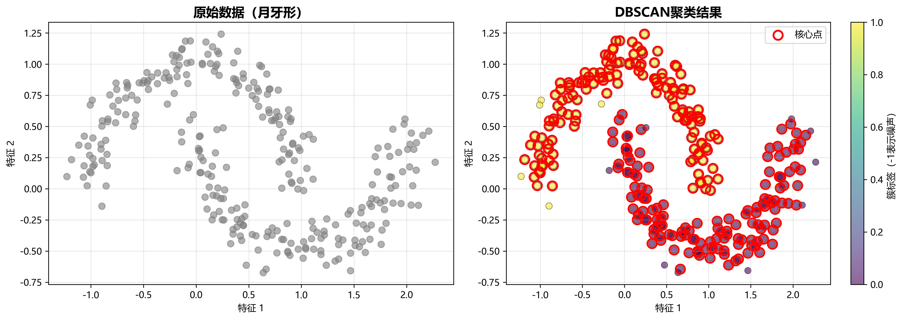

#### 📊 图片视觉解析

**【左图：原始数据】**
- 300个灰色散点形成两个**互相环抱的月牙形**簇
- 上方月牙从左上弯曲到右侧，下方月牙从左下弯曲到右侧
- 两个月牙之间有明显空隙，但形状复杂、边界弯曲

**【右图：DBSCAN聚类结果】**
- **参数**：`eps=0.2, min_samples=5`
- **红色空心圆圈○**：标记的是**核心点**，沿着月牙曲线密集分布
- **紫色点**：簇0（下方月牙），**黄色点**：簇1（上方月牙）
- 右侧有几个紫色孤立点（可能是边界点）

---

#### 🎓 深度原理讲解

**1. DBSCAN如何识别非凸形状？**

传统的K-Means聚类假设簇是**球形**的，它通过计算到中心点的距离来划分边界。这会导致一个问题：

```
如果用K-Means(k=2)聚类这个月牙数据：
- K-Means会在两个月牙之间画一条"直线边界"
- 结果：上月牙的左半部分和下月牙的左半部分被分到一起
       上月牙的右半部分和下月牙的右半部分被分到另一组
- 完全错误！
```

而**DBSCAN的核心思想是"密度可达"**：
- 它不关心"到中心的距离"，而是关心"局部密度"
- 只要两个点在eps邻域内，且都是核心点，它们就属于同一簇
- 这样就能**沿着曲线方向连接**，形成任意形状的簇

**2. 从图中看"密度连接"的过程**

观察右图的红色圆圈（核心点）分布：
1. **核心点像"骨架"**：它们沿着月牙的中心线连续分布
2. **连接过程**：
   - 选一个上月牙的核心点A
   - 在A的eps=0.2邻域内找到另一个核心点B
   - B的邻域内又能找到核心点C
   - 这样不断连接，形成一条"链条"
   - 这条链条可以是弯曲的！
3. **边界确定**：
   - 月牙边缘的点虽然不是核心点，但在核心点的邻域内
   - 这些点被标记为"边界点"，也属于这个簇

**3. 参数eps=0.2的关键作用**

看图中两个月牙之间的间隙：
- **如果eps太小**（如0.1）：同一月牙内的点也连接不上，会被分成多个小簇
- **如果eps=0.2**（当前设置）：✓ 刚好能让同一月牙内的点相连，但两个月牙之间连不上
- **如果eps太大**（如0.5）：两个月牙会被错误地合并成一个簇

**从图中测量**：注意月牙内部相邻点的距离 < 0.2，但两个月牙之间的最短距离 > 0.2

**4. 为什么min_samples=5？**

这个参数定义"什么是核心点"：
- **含义**：一个点的eps邻域内至少要有5个点（包括自己），才是核心点
- **作用**：过滤掉低密度区域，防止噪声干扰
- **从图看**：月牙的主体区域密度很高，大部分点都能成为核心点（红圈很多）
- **边缘区域**：月牙的尖端密度较低，可能不是核心点，但仍属于簇（边界点）

---

#### 💡 教学演示要点

**向学生提问1**："为什么K-Means不能处理这个数据？"
- 答案：K-Means用"距离中心点的远近"划分边界，只能画直线或超平面边界，无法处理弯曲形状

**向学生提问2**："指着红色圆圈问：这些核心点有什么特点？"
- 答案：它们在局部都很密集，且连续分布，像一条"骨架"定义了簇的形状

**实验建议**：
1. 用K-Means(k=2)跑同样数据，让学生看到错误结果
2. 调整eps参数（0.1, 0.2, 0.4），观察聚类结果变化
3. 让学生手动测量图中点的距离，理解eps的物理意义

**核心结论**：
✅ DBSCAN通过"密度连接"而非"距离中心"来定义簇，可以识别**任意形状**
✅ 参数eps控制"局部"的范围，min_samples控制"密度"的阈值
✅ 核心点定义簇的形状，边界点填充簇的边缘

---

### 🔍 示例2：噪声处理（图2）

**文件**: `2_DBSCAN_噪声处理.png`

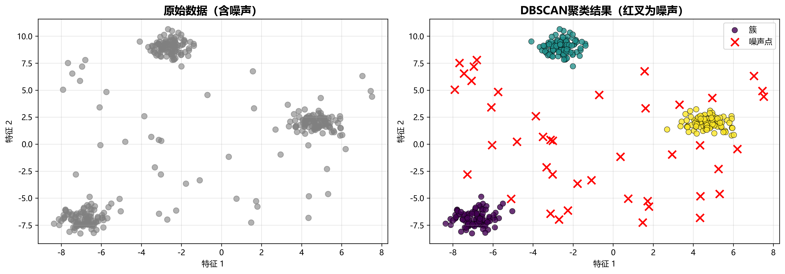

#### 📊 图片视觉解析

**【左图：含噪声的原始数据】**
- **3个密集簇**：左下角、上方、右下方各有一个紧凑的点集
- **散落的噪声点**：在整个空间中随机分布的孤立点
- 总共350个点 = 300个真实数据点 + 50个人工添加的噪声点

**【右图：DBSCAN聚类结果】**
- **参数**：`eps=0.8, min_samples=5`
- **紫色簇**：左下角的密集区域
- **青色簇**：上方的密集区域
- **黄色簇**：右下方的密集区域
- **红色×标记**：被识别为噪声的点，散落在整个空间

---

#### 🎓 深度原理讲解

**1. DBSCAN如何自动检测噪声？**

这是DBSCAN最强大的特性之一！传统的K-Means有个致命缺陷：
```
K-Means的强制分配问题：
- K-Means必须把每个点分配到某个簇
- 即使是明显的噪声点，也会被"硬塞"到最近的簇中
- 结果：噪声点会"污染"簇的中心，拉偏聚类结果
```

而**DBSCAN的噪声检测机制**：
1. **噪声的定义**：一个点如果满足以下条件，就是噪声
   - 它自己不是核心点（eps邻域内点数 < min_samples）
   - 它也不在任何核心点的eps邻域内（不是边界点）
   
2. **从图中看噪声识别**：
   - 观察右图中的红色×，它们都很孤立
   - 每个×周围0.8半径内的点数都 < 5个
   - 它们也不靠近任何密集区域（距离所有簇都 > 0.8）

**2. 参数eps=0.8的选择逻辑**

这个例子的eps比图1大很多（0.8 vs 0.2），为什么？

**看数据的空间尺度**：
- 图1的月牙数据：X和Y范围都在[-1, 2.5]，总跨度约3.5
- 图2的噪声数据：X和Y范围都在[-10, 10]，总跨度约20

**eps的选择原则**：
```
eps应该是"簇内点的典型距离"
- 观察左图：同一簇内相邻点距离 ≈ 0.5-1.0
- 不同簇之间的距离 >> 5.0
- 噪声点到最近簇的距离 >> 1.0
- 所以eps=0.8是合理的：能连接簇内点，但不会误连噪声
```

**3. 从图中观察噪声分布规律**

仔细看右图的红色×标记：
- **空间分布**：均匀散落，没有聚集
- **与簇的距离**：每个×到最近簇的距离都 > eps=0.8
- **数量**：大约有40-50个×（接近我们添加的50个噪声）

**识别成功的证据**：
✓ 所有真实簇（紫、青、黄）都很紧凑，没有孤立点
✓ 所有散落的点都被标记为噪声
✓ 没有"误伤"：真实簇的点没有被错误标记为噪声

**4. 为什么这对真实数据很重要？**

**真实场景中的噪声来源**：
- 传感器故障导致的异常读数
- 数据录入错误
- 极端异常值（outliers）
- 不同类别的少量混入样本

**DBSCAN的优势**：
```
场景：客户聚类分析
- 大部分客户形成3个明确的消费群体
- 少数客户行为极端异常（如测试账号、刷单账号）
- K-Means：会把异常客户硬塞进某个群体，污染结果
- DBSCAN：把异常客户标记为噪声(-1)，单独处理
```

---

#### 💡 教学演示要点

**向学生提问1**："如果用K-Means(k=3)聚类这个数据，会发生什么？"
- 答案：噪声点会被强制分配到3个簇中，导致：
  - 簇中心被拉偏
  - 簇的边界不准确
  - 无法识别出哪些是异常数据

**向学生提问2**："指着某个红×问：为什么这个点是噪声？"
- 答案：在0.8半径内找不到5个邻居，且不在任何核心点附近

**实验建议**：
1. 运行K-Means(k=3)对比，看噪声如何污染结果
2. 调整min_samples（3, 5, 10），观察噪声识别的严格程度
3. 统计噪声数量，验证是否接近真实添加的50个

**实际应用案例**：
- **异常检测**：信用卡欺诈检测、网络入侵检测
- **数据清洗**：识别并移除数据集中的异常值
- **质量控制**：制造业中识别不合格产品

**核心结论**：
✅ DBSCAN不强制分配每个点，可以自动识别噪声（标签-1）
✅ 噪声点的判定：既不是核心点，也不是边界点
✅ 这使DBSCAN在真实数据上比K-Means更鲁棒
✅ 适合有异常值和离群点的数据集

---

### 🎛️ 示例3：参数对比分析（图3）

**文件**: `3_DBSCAN_参数对比.png`

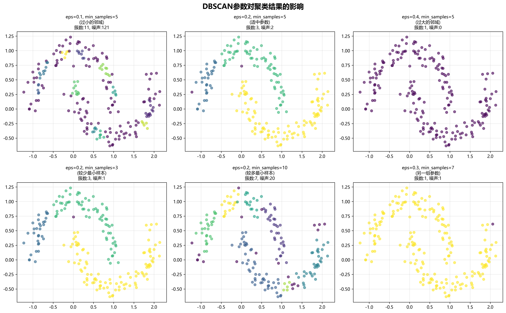

#### 📊 图片视觉解析

这是一个**2×3网格**的对比图，6个子图展示同一数据集在不同参数下的聚类结果：

| 位置 | eps | min_samples | 簇数 | 噪声数 | 视觉特征 |
|------|-----|------------|------|--------|---------|
| **左上** | 0.1 | 5 | 11 | 121 | 大量碎片化小簇，多种颜色混杂 |
| **中上** | 0.2 | 5 | 3 | 2 | 清晰的3个簇（紫、黄、绿），干净整洁 ✓ |
| **右上** | 0.4 | 5 | 1 | 0 | 全部是紫色，所有点合并成一个簇 |
| **左下** | 0.2 | 3 | 3 | 1 | 3个簇，与中上类似但稍松散 |
| **中下** | 0.2 | 10 | 7 | 20 | 多个小簇，更多碎片化 |
| **右下** | 0.3 | 7 | 1 | 1 | 基本是一个大簇（黄色） |

**原始数据**：月牙形数据集，实际有2个弯曲的簇

---

#### 🎓 深度原理讲解

这张图是理解DBSCAN参数调优的**黄金示例**！让我们逐个参数分析：

**1. eps参数的影响（控制变量：min_samples=5）**

对比**左上、中上、右上**三张图：

**左上：eps=0.1（过小）→ 11个簇，121个噪声**
```
发生了什么？
- eps=0.1的邻域半径太小
- 即使在同一个月牙内，相邻点距离也可能 > 0.1
- 结果：月牙被"撕裂"成多个小碎片
- 连接断裂的点无法形成核心点 → 被标记为噪声

视觉证据：
- 观察图中颜色非常杂乱（11种颜色）
- 每个颜色簇都很小，只有几个点
- 原本应该连续的月牙变成了断断续续的碎片
```

**中上：eps=0.2（最佳）→ 3个簇，2个噪声**
```
为什么是最佳？
- eps=0.2恰好能让月牙内部的点相互连接
- 月牙内点的典型距离 ≈ 0.15-0.25
- 两个月牙之间的最小距离 ≈ 0.3-0.4
- 所以eps=0.2能分开两个月牙，又能保持每个月牙的完整性

视觉证据：
- 3种清晰的颜色（紫、黄、绿/青）
- 每个簇形状完整，边界清晰
- 几乎没有噪声点
```

**右上：eps=0.4（过大）→ 1个簇，0个噪声**
```
发生了什么？
- eps=0.4的邻域太大
- 两个月牙之间的间隙 < 0.4
- 结果：两个月牙被错误地连接成一个簇
- 所有点都变成核心点或边界点，没有噪声

视觉证据：
- 整张图都是紫色
- 完全失去了区分能力
```

**2. min_samples参数的影响（控制变量：eps=0.2）**

对比**中上、左下、中下**三张图：

**左下：min_samples=3（宽松）→ 3个簇，1个噪声**
```
影响分析：
- 降低核心点的门槛（邻域内只需3个点）
- 更多点能成为核心点
- 簇更容易形成，噪声更少

与中上对比：
- 簇数相同（都是3）
- 但噪声更少（1 vs 2）
- 原因：一些边缘点在min_samples=3时能成为核心点，在=5时是边界点
```

**中下：min_samples=10（严格）→ 7个簇，20个噪声**
```
影响分析：
- 提高核心点的门槛（邻域内需10个点）
- 只有密度非常高的区域才能成为核心点
- 月牙的边缘和尾端密度不够，无法形成核心点
- 结果：簇被分裂，边缘点变成噪声

视觉证据：
- 颜色更杂（7种），说明簇被过度分割
- 很多点变成噪声（20个）
- 每个簇都只包含密度最高的核心区域
```

**3. 参数协同效应（右下：eps=0.3, min_samples=7）**

```
这是一个"折中"的参数组合：
- eps增大 → 倾向于合并簇
- min_samples增大 → 倾向于分割簇和产生噪声
- 两者部分抵消

结果：1个簇，1个噪声
- eps=0.3足够大，把大部分点连接在一起
- min_samples=7的要求不算特别严格
- 最终形成一个大簇
```

**4. 参数调优的实战策略**

**问题：如何为新数据集选择参数？**

**步骤1：估计eps**
```python
# 方法1：K-distance图
from sklearn.neighbors import NearestNeighbors
k = 5  # min_samples的候选值
neigh = NearestNeighbors(n_neighbors=k)
neigh.fit(X)
distances, indices = neigh.kneighbors(X)
distances = np.sort(distances[:, k-1], axis=0)
# 画图，找"肘部"，那就是合适的eps

# 方法2：数据分布观察
# 看数据的整体范围，eps通常是范围的5%-10%
```

**步骤2：选择min_samples**
```
经验规则：
- 2D数据：min_samples ≈ 4-5
- 高维数据：min_samples ≈ 2 × 维度
- 有噪声：增大min_samples
- 无噪声：减小min_samples
```

**步骤3：迭代调整**
```
观察结果 → 调整参数：
- 簇太多、噪声太多 → 增大eps 或 减小min_samples
- 簇太少（合并过度） → 减小eps 或 增大min_samples
- 就像这张图展示的6种情况！
```

---

#### 💡 教学演示要点

**互动实验**：让学生预测结果
1. "如果我把eps从0.2改成0.15，会发生什么？"
   - 答案：簇数增加，噪声增加（介于左上和中上之间）

2. "如果我把min_samples从5改成20，会发生什么？"
   - 答案：簇会碎裂，大量点变成噪声（比中下更极端）

**对比练习**：
- 打印6张图，让学生按"聚类质量"排序
- 讨论为什么中上图是最好的
- 学习识别"过拟合"（左上）和"欠拟合"（右上）

**参数敏感性分析**：
| 参数变化 | eps | min_samples | 敏感度 |
|---------|-----|-------------|--------|
| 簇形状复杂时 | 非常敏感 | 中等敏感 | eps更关键 |
| 有噪声时 | 中等敏感 | 非常敏感 | min_samples更关键 |
| 密度均匀时 | 低敏感 | 低敏感 | 都不太关键 |

**核心结论**：
✅ **eps控制"连接范围"**：太小→碎片化，太大→过度合并
✅ **min_samples控制"密度阈值"**：太小→过于宽松，太大→过于严格
✅ **没有万能参数**：需要根据数据特点调整
✅ **调参是迭代过程**：观察结果 → 分析问题 → 调整参数 → 再观察
✅ **这张图就是最好的调参指南**：6种典型情况涵盖了常见问题

---

## 第二部分：CLIQUE聚类算法

### 📌 核心概念

CLIQUE（CLustering In QUEst）是一种基于网格的聚类算法：

| 步骤 | 说明 |
|------|------|
| 1️⃣ **网格划分** | 将数据空间分割成均匀的网格单元 |
| 2️⃣ **密集单元** | 统计每个网格中的数据点数 |
| 3️⃣ **阈值判断** | 点数≥阈值则为"密集单元" |
| 4️⃣ **簇形成** | 连接相邻的密集单元形成簇 |

**算法优势**：⚡ 时间复杂度O(n)，与数据量线性相关

---

### 🔍 示例1：基本网格聚类（图4）

**文件**: `4_CLIQUE_基本聚类.png`

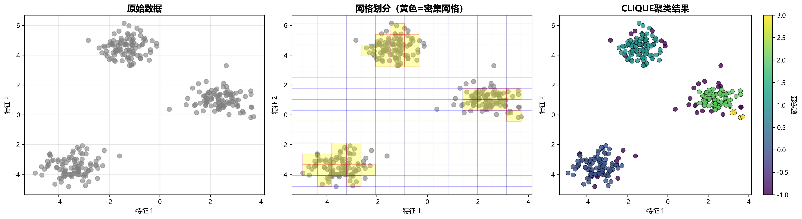

#### 📊 图片视觉解析

这是CLIQUE算法的**工作流程三步图**：

**【左图：原始数据】**
- 300个灰色散点，分布在空间坐标系中
- 肉眼可见三个密集的团块：左下、中上、右下
- 典型的"Blob"簇分布，簇间有明显间隔

**【中图：网格划分与密集单元】**
- **灰色网格线**：15×15的均匀网格（共225个单元格）
- **黄色方块区域**：密集单元（该格子内点数≥3）
- 左下、中上、右下各有一片黄色区域，对应三个簇的位置
- 空白区域：稀疏单元或无点单元

**【右图：聚类结果】**
- **紫色簇**：左下区域
- **绿色簇**：中上区域  
- **青色簇**：右下区域
- 右侧颜色条显示簇标签（0到3.0）

---

#### 🎓 深度原理讲解

**1. CLIQUE的核心思想：从"点的连接"到"格子的连接"**

回顾DBSCAN：
```
DBSCAN的思路：
1. 对每个点，计算eps邻域内有多少个点
2. 点数≥min_samples → 核心点
3. 连接相邻的核心点形成簇

问题：在大数据集上，计算每个点的邻域很慢！
- 100万个点，每个点都要搜索邻域
- 时间复杂度：O(n²) 或 O(n log n)（用KD树）
```

**CLIQUE的优化**：
```
CLIQUE的思路：
1. 把空间划分成固定的网格
2. 统计每个格子里有多少个点（一次遍历，O(n)）
3. 点数≥阈值的格子 → 密集单元
4. 连接相邻的密集单元形成簇

优势：时间复杂度 O(n)！
- 不需要对每个点做距离计算
- 只需要判断点属于哪个格子（简单的除法运算）
```

**2. 从中图看网格划分的过程**

**网格如何划分**：
```python
# 假设数据范围：X轴[-6, 6]，Y轴[-6, 6]
n_grids = 15
grid_width = (6 - (-6)) / 15 = 0.8

# 每个格子的边界
格子[i][j]的范围：
  X: [-6 + i*0.8, -6 + (i+1)*0.8]
  Y: [-6 + j*0.8, -6 + (j+1)*0.8]
```

**密集单元的判定**：
```
观察中图的黄色区域：
- 左下簇：大约占据3×4 = 12个格子
- 中上簇：大约占据3×3 = 9个格子
- 右下簇：大约占据2×3 = 6个格子

每个黄色格子至少有3个点（density_threshold=3）
```

**3. 网格连接形成簇**

**相邻定义**：两个格子"相邻"如果它们：
- 共享一条边（4-连接）
- 或共享一个角（8-连接）

CLIQUE使用**8-连接**：
```
对于格子[i][j]，它的8个邻居是：
[i-1,j-1] [i-1,j] [i-1,j+1]
[i,  j-1] [i,  j] [i,  j+1]
[i+1,j-1] [i+1,j] [i+1,j+1]
```

**簇的形成过程**：
1. 找到所有黄色格子（密集单元）
2. 从一个黄色格子开始，搜索它的8个邻居
3. 如果邻居也是黄色，标记为同一簇，继续搜索邻居的邻居
4. 这样形成一个"连通域"
5. 重复1-4，找到所有簇

**从中图看连通性**：
- 左下的黄色格子形成一个连通区域 → 紫色簇
- 中上的黄色格子形成另一个连通区域 → 绿色簇
- 右下的黄色格子形成第三个连通区域 → 青色簇
- 它们之间没有黄色格子连接 → 分成3个簇

**4. CLIQUE vs DBSCAN：同样的数据，不同的视角**

| 特性 | DBSCAN | CLIQUE |
|------|--------|--------|
| **基本单元** | 点 | 格子 |
| **密度定义** | 点的邻域内点数 | 格子内点数 |
| **连接方式** | 点与点的eps距离 | 格子与格子的相邻关系 |
| **计算复杂度** | O(n log n) | **O(n)** |
| **内存占用** | 小 | 中（需存储格子） |
| **精度** | 高（点级别） | 中（格子级别） |
| **高维适应性** | 差（维数诅咒） | **好（网格数固定）** |

**5. 为什么n_grids=15？**

**网格数的选择原则**：
```
太少（如5×5 = 25个格子）：
- 粒度太粗，多个簇可能被合并
- 无法捕捉细节

太多（如50×50 = 2500个格子）：
- 粒度太细，一个簇被分成多个碎片
- 内存占用大

经验规则：
- n_grids ≈ √n（n是样本数）
- 或：n_grids ≈ 10-20（对于2D数据）
- 这个例子：√300 ≈ 17，选15接近
```

---

#### 💡 教学演示要点

**互动提问1**："为什么CLIQUE比DBSCAN快？"
- 答案：CLIQUE只需计算点属于哪个格子（O(1)操作），而DBSCAN需要搜索每个点的邻域（O(log n)或O(n)）

**互动提问2**："指着中图问：如果两个簇之间有一个黄色格子连接，会怎样？"
- 答案：两个簇会被错误地合并成一个簇（这时需要减小grid_width或增大density_threshold）

**可视化演示建议**：
1. **动画展示网格划分**：一个一个格子地统计点数，标记密集单元
2. **动画展示连通搜索**：从一个黄色格子开始，逐步扩展到相邻格子
3. **对比实验**：同样数据分别用DBSCAN和CLIQUE，比较速度和结果

**实际应用场景**：
- **图像分割**：把图像像素看作点，网格就是图像本身的像素网格
- **空间数据分析**：地理信息系统中的热点检测
- **大规模数据**：百万级样本的快速聚类

**核心结论**：
✅ CLIQUE用**网格量化**代替**精确距离计算**，大幅提升速度
✅ 密集单元的概念直观：**格子内点数≥阈值**
✅ 簇通过**格子的连通性**定义，而非点的连通性
✅ 适合**大规模、高维数据**，但牺牲了一定精度（格子级别 vs 点级别）
✅ 参数调优更简单：主要调n_grids和density_threshold

---

### 🎛️ 示例2：网格大小的影响（图5）

**文件**: `5_CLIQUE_网格对比.png`

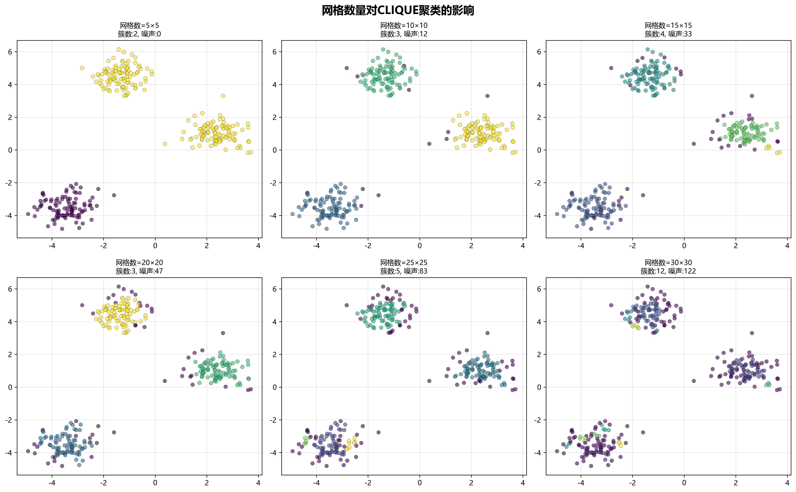

#### 📊 图片视觉解析

这是**2×3网格排列**的参数对比图，展示同一数据集在6种不同网格设置下的聚类效果：

| 位置 | 网格数 | 簇数 | 噪声数 | 视觉特征 |
|------|--------|------|--------|---------|
| **左上** | 5×5 | 2 | 0 | 只有黄色和紫色两个大簇 |
| **中上** | 10×10 | 3 | 12 | 三种颜色，有少量紫色噪声点散落 |
| **右上** | 15×15 | 4 | 33 | 四种颜色，较多紫色噪声点 |
| **左下** | 20×20 | 3 | 47 | 三种主色，噪声点更多 |
| **中下** | 25×25 | 5 | 83 | 五种颜色，大量紫色噪声 |
| **右下** | 30×30 | 12 | 122 | 颜色混杂，大部分是紫色噪声 |

**原始数据**：3个Blob簇（左下、中上、右下）

---

#### 🎓 深度原理讲解

这张图完美展示了**网格粒度对聚类结果的影响**！这是CLIQUE最重要的调参指南。

**1. 网格太粗（5×5）：合并过度**

**视觉观察**：
- 只分出2个簇（黄色+紫色）
- 没有任何噪声点
- 右上角的一个簇和中上的簇被合并了

**原理分析**：
```
网格数 = 5×5 = 25个格子
数据范围假设：[-6, 6] × [-6, 6]
每个格子大小：12/5 = 2.4 × 2.4

问题：
- 格子太大，一个格子可能跨越多个簇
- 本来分离的两个簇，它们之间的格子也被标记为密集单元
- 导致过度连接

类比：
就像用粗网捕鱼，网眼太大，小鱼都漏走了
这里是"网眼太大，不同的簇都被网在一起了"
```

**2. 网格适中（10×10, 15×15）：平衡良好**

**中上图（10×10）**：
```
簇数：3（接近真实的3个簇）
噪声：12个（少量）

优点：
- 成功识别出3个主要簇
- 噪声点不多，大部分点被正确分类

格子大小：12/10 = 1.2 × 1.2
- 既能捕捉簇的整体形状
- 又不会把不同簇连接起来
```

**右上图（15×15）**：
```
簇数：4（比真实多1个）
噪声：33个（中等）

发生了什么？
- 某个簇被分成了2个子簇
- 边缘的点开始被标记为噪声
- 但主体结构仍然清晰

格子大小：12/15 = 0.8 × 0.8
- 粒度更细，能捕捉更多细节
- 但开始出现过度分割的迹象
```

**3. 网格太细（25×25, 30×30）：碎片化严重**

**中下图（25×25）**：
```
簇数：5（过多）
噪声：83个（很多）

格子大小：12/25 = 0.48 × 0.48

问题：
- 一个簇内部的点分布不是完全均匀的
- 有些格子恰好没有点或点数<阈值
- 导致簇的"骨架"断裂，形成多个小簇
```

**右下图（30×30）**：
```
簇数：12（严重过度分割）
噪声：122个（大量，占40%）

格子大小：12/30 = 0.4 × 0.4

视觉特征：
- 几乎全是紫色（噪声点）
- 只有少量其他颜色的小簇
- 完全失去了聚类的意义

类比：
就像把一张照片的分辨率提得太高
- 本来是连续的图像，变成了一个个孤立的像素
- 看不出整体结构了
```

**4. 噪声数量的变化规律**

观察噪声数量的增长趋势：
```
5×5:   0个噪声  （所有点都被分配到簇）
10×10: 12个噪声 （边缘点开始被排除）
15×15: 33个噪声 （更多边缘点被排除）
20×20: 47个噪声
25×25: 83个噪声
30×30: 122个噪声 （几乎一半是噪声）
```

**为什么噪声会增加？**
```
随着网格变细：
1. 格子数量增加：5² → 30² (25倍增长)
2. 每个格子变小，点数变少
3. 很多格子点数 < density_threshold
4. 这些格子内的点被标记为噪声

特别是边缘区域：
- 簇的边缘本来点就稀疏
- 格子变小后，更容易低于阈值
- 边缘点被大量标记为噪声
```

**5. 最佳网格数的选择策略**

**经验公式**：
```python
# 方法1：根据样本数
n_grids = int(np.sqrt(n_samples))
# 300个样本 → √300 ≈ 17

# 方法2：根据数据范围和期望簇大小
data_range = X.max() - X.min()
expected_cluster_width = 2.0  # 估计簇的直径
n_grids = int(data_range / expected_cluster_width * 3)
# 确保每个簇跨越3-5个格子

# 方法3：二分搜索
# 从小网格开始，逐步增加，找到噪声率<10%的最大网格数
```

**实际调参流程**：
```
1. 先用中等网格（如√n）试试
2. 观察噪声率：
   - 噪声<5%：网格太粗，增大n_grids
   - 噪声>20%：网格太细，减小n_grids
   - 噪声5-20%：合理范围
3. 观察簇数：
   - 簇数太少：增大n_grids（更细）
   - 簇数太多：减小n_grids（更粗）
```

**6. 从图看参数选择的trade-off**

```
网格数 ↑（更细）的效果：
  优点：
  + 能捕捉更细节的簇结构
  + 能分离更紧密的簇
  
  缺点：
  - 噪声点增加
  - 簇可能被碎片化
  - 计算和内存开销增大

网格数 ↓（更粗）的效果：
  优点：
  + 噪声点减少
  + 簇更稳定、连续
  + 计算更快
  
  缺点：
  - 可能合并本应分离的簇
  - 丢失细节结构
```

---

#### 💡 教学演示要点

**互动提问1**："看右下图（30×30），为什么会产生这么多噪声？"
- 答案：格子太小，单个格子内点数很少，大多数格子点数<density_threshold，导致大量点被标记为噪声

**互动提问2**："如果我们的目标是找到所有可能的子簇（包括小簇），应该选哪个参数？"
- 答案：25×25或30×30，虽然噪声多，但能发现更多细粒度的簇结构

**对比实验**：
1. 让学生猜测"如果用40×40会怎样"（答案：几乎全是噪声）
2. 画出"噪声率 vs 网格数"的曲线，看指数增长趋势
3. 讨论：对于这个数据集，最佳选择是哪个？（10×10或15×15）

**实际应用考虑**：
```
场景1：客户细分（需要粗粒度分群）
→ 选小网格数（如10×10），容忍一些合并

场景2：异常检测（需要精确识别小簇）
→ 选大网格数（如25×25），容忍更多噪声

场景3：可视化展示（需要清晰简洁）
→ 选中等网格数（如15×15），平衡效果
```

**核心结论**：
✅ **网格数是CLIQUE最关键的参数**，直接影响聚类粒度
✅ **网格太粗（如5×5）**：过度合并，损失细节，噪声少
✅ **网格太细（如30×30）**：过度分割，产生大量噪声，簇碎片化
✅ **最佳网格数 ≈ √n**：平衡聚类质量和噪声率
✅ **噪声率是重要指标**：噪声5-20%通常是合理范围
✅ **需要根据应用场景调整**：粗粒度分群 vs 细粒度检测

---

### 🔍 示例3：复杂形状处理（图6）

**文件**: `6_CLIQUE_复杂形状.png`

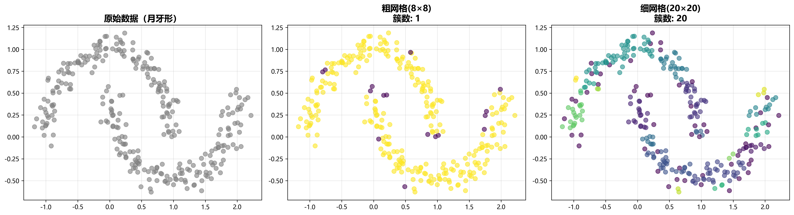

#### 📊 图片视觉解析

这是**月牙形数据的CLIQUE处理**三步图，展示网格粒度对复杂形状的影响：

**【左图：原始数据】**
- 300个灰色点形成两个**互相环抱的月牙形**
- 这是图1（DBSCAN月牙形）的同一数据集
- 非凸、弯曲的复杂形状

**【中图：粗网格 8×8，簇数=1】**
- 稀疏的网格线（只有8×8=64个格子）
- 所有点被聚成**一个大的黄色簇**
- 完全无法分离两个月牙

**【右图：细网格 20×20，簇数=20】**
- 密集的网格线（20×20=400个格子）
- 产生了**20个不同颜色的小簇**
- 颜色沿着月牙曲线变化：紫→青→绿→黄
- 过度碎片化，但能"追踪"月牙的弯曲路径

---

#### 🎓 深度原理讲解

这张图展示了**CLIQUE处理复杂形状的能力和局限性**！

**1. 为什么粗网格（8×8）失败了？**

**视觉分析**：
- 中图所有点都是黄色，被错误地聚成一个簇

**原理分析**：
```
网格大小 = 数据范围 / 8
假设月牙范围：X轴[-1, 2.5]，Y轴[-0.75, 1.25]
格子宽度 ≈ 3.5 / 8 ≈ 0.44

问题：
1. 格子太大，跨越了两个月牙之间的间隙
2. 两个月牙之间有多个格子同时包含两边的点
3. 这些"桥接格子"导致两个月牙被连接起来

视觉证据：
- 在月牙靠近的中间区域，格子必然覆盖两侧
- 这些格子点数>=阈值，成为密集单元
- 通过这些桥接格子，两个月牙被错误连接
```

**对比DBSCAN**：
```
回顾图1的DBSCAN结果：
- eps=0.2时，DBSCAN完美分离两个月牙
- 因为DBSCAN看的是"点到点的距离"
- 两个月牙之间点的距离 > eps，所以不连接

CLIQUE的问题：
- CLIQUE看的是"格子的连通性"
- 即使两个月牙的点距离>0.2，但如果在同一个格子里
- 这个格子就会成为"桥梁"
- 这就是网格量化带来的精度损失
```

**2. 细网格（20×20）能处理复杂形状吗？**

**视觉分析**：
- 右图产生了20个小簇
- 但观察颜色分布：沿着月牙的走向，颜色是连续变化的
- 说明CLIQUE确实在"跟踪"月牙的形状

**原理分析**：
```
网格大小 = 3.5 / 20 ≈ 0.175

优点：
1. 格子足够小，两个月牙之间没有桥接格子
2. 每个月牙被分成多个小段
3. 每一小段是一个簇

问题：
1. 过度碎片化：20个簇 vs 实际2个簇
2. 丢失了"整体性"：月牙被撕裂成碎片

为什么会碎片化？
- 月牙不是均匀密度：
  - 弯曲处（转折点）密度较低
  - 直线段密度较高
- 细网格下，低密度区域的格子点数<阈值
- 导致同一月牙被分割成多段
```

**3. CLIQUE vs DBSCAN：复杂形状对决**

这是一个关键对比！让我们回顾图1的DBSCAN结果：

| 特性 | DBSCAN (图1) | CLIQUE粗网格 (中图) | CLIQUE细网格 (右图) |
|------|-------------|-------------------|-------------------|
| **簇数** | 2（正确） | 1（错误合并） | 20（过度分割） |
| **形状识别** | ✓ 完美 | ✗ 完全失败 | △ 部分成功 |
| **簇完整性** | ✓ 保持 | ✗ 合并 | ✗ 碎片化 |
| **参数敏感性** | 中等 | 高 | 高 |

**根本原因**：
```
DBSCAN的优势：
- 基于点的密度连接
- 可以沿着任意曲线"爬行"
- 只要局部密度足够，就能连接
- 不受全局几何形状限制

CLIQUE的劣势：
- 基于格子的连通性
- 格子是刚性的、规则的
- 无法灵活适应曲线形状
- 要么太粗（合并），要么太细（碎片）
```

**4. 能否找到完美的网格数？**

**理论分析**：
```
假设我们尝试中间值，如12×12或15×15：

可能结果：
- 如果运气好：可能分成2-3个簇
- 但很难恰好分成2个完整的月牙
- 因为两个月牙之间的间隙不是均匀的

问题的本质：
- 用"规则的网格"去拟合"不规则的曲线"
- 这是一个inherent的矛盾
- 像用正方形拼成圆形，总会有误差
```

**实验验证**（可建议学生尝试）：
```python
for n_grids in [10, 12, 15, 18]:
    # 运行CLIQUE
    # 观察是否有参数能恰好分成2个簇
    # 结果：很难找到完美参数
```

**5. CLIQUE适合什么形状？**

**适合的形状**：
```
✓ 球形、椭圆形簇（Blob）
✓ 矩形、多边形簇
✓ 分离明显的簇（间隙大）
✓ 密度均匀的簇

示例：图4的3个Blob簇 → CLIQUE表现优秀
```

**不适合的形状**：
```
✗ 弯曲的月牙形、S形
✗ 环形、同心圆
✗ 密度不均匀的长条形
✗ 间隙很小的紧密簇

示例：图6的月牙形 → CLIQUE表现不佳
```

**6. 什么时候应该用CLIQUE而非DBSCAN？**

**CLIQUE的优势场景**：
```
1. 数据量巨大（百万级以上）
   - CLIQUE: O(n) 线性时间
   - DBSCAN: O(n log n) 或更慢

2. 维度很高（10维以上）
   - CLIQUE: 网格数固定，不受维度影响太大
   - DBSCAN: 受"维数诅咒"影响，距离计算失效

3. 簇形状简单（Blob型）
   - CLIQUE: 足够准确
   - DBSCAN: 过度精确（浪费计算）

4. 需要快速粗粒度分群
   - CLIQUE: 调小网格数，快速划分
   - DBSCAN: 参数难调
```

**DBSCAN的优势场景**：
```
1. 数据量中等（万级到十万级）
   - 速度差异不明显

2. 簇形状复杂（月牙、环形等）
   - DBSCAN: 完美处理
   - CLIQUE: 无法处理

3. 需要精确边界
   - DBSCAN: 点级别精度
   - CLIQUE: 格子级别精度（粗糙）

4. 低维数据（2-5维）
   - DBSCAN: 距离计算有效
```

---

#### 💡 教学演示要点

**对比实验**：将图1（DBSCAN）和图6并排展示
1. "同样的月牙数据，为什么DBSCAN能完美分离，而CLIQUE不行？"
   - 答案：DBSCAN基于点的连接，CLIQUE基于格子的连接

2. "能否调整CLIQUE参数，达到DBSCAN的效果？"
   - 答案：很难。需要运气好才能刚好分成2个簇

**互动提问**："如果数据是3个分离的圆形簇，CLIQUE和DBSCAN谁更好？"
- 答案：CLIQUE更好（速度快，结果相当）
- 引导学生理解：算法选择要看数据特点

**可视化建议**：
```
动画1：展示不同网格数的效果
- 从5×5开始，逐步增加到30×30
- 观察簇数的变化：1 → 2 → 5 → 10 → 20 → 40

动画2：对比DBSCAN和CLIQUE的搜索过程
- DBSCAN：点一个个沿着曲线连接
- CLIQUE：格子一个个按相邻关系连接
- 直观看出差异
```

**实际建议**：
```
如果你的数据可能有复杂形状：
1. 先用DBSCAN试试（如果数据量不太大）
2. 如果DBSCAN太慢，再考虑CLIQUE
3. 或者组合使用：
   - 先用CLIQUE快速粗分
   - 再对每个大簇用DBSCAN精细分
```

**核心结论**：
✅ **CLIQUE难以处理复杂弯曲形状**（如月牙、S形）
✅ **网格量化是双刃剑**：带来速度，牺牲精度
✅ **粗网格**：合并不同簇（如8×8把两个月牙合并）
✅ **细网格**：碎片化同一簇（如20×20把月牙撕裂）
✅ **CLIQUE适合Blob型簇**，不适合任意形状
✅ **DBSCAN在复杂形状上完胜**，但速度较慢
✅ **算法选择要看应用**：速度 vs 精度，简单形状 vs 复杂形状

---

## 📖 继续学习

DBSCAN和CLIQUE算法的深度讲解已完成！

**接下来的内容请查看**：👉 **[教学讲解文档2.md](./教学讲解文档2.md)**

包括：
- **第三部分：GMM聚类算法**（图7-10）
  - 基本聚类原理
  - 协方差类型对比
  - 模型选择（BIC/AIC）
  - GMM vs K-Means对比
  
- **第四部分：三算法综合对比**（图11）
  - 5种数据分布的全面对比
  - 各算法优劣势分析
  
- **第五部分：真实数据集案例**（图12-14）
  - Iris鸢尾花数据集
  - Wine葡萄酒数据集
  - Digits手写数字数据集

---

## 第一部分总结

### ✅ 已完成深度讲解的算法

#### DBSCAN（基于密度的聚类）
- ✓ **图1 - 月牙形数据**：密度连接原理，如何识别非凸形状
- ✓ **图2 - 噪声处理**：噪声检测机制，自动识别离群点
- ✓ **图3 - 参数对比**：eps和min_samples的影响，调参策略

#### CLIQUE（基于网格的聚类）
- ✓ **图4 - 基本聚类**：网格划分原理，O(n)时间复杂度
- ✓ **图5 - 网格对比**：网格粒度的影响，最佳参数选择
- ✓ **图6 - 复杂形状**：CLIQUE vs DBSCAN，算法适用场景

### 🎯 核心要点回顾

**DBSCAN的精髓**：
- 通过"密度可达"定义簇，可以识别任意形状
- 自动检测噪声点（标签-1），不强制分配
- 参数调优困难但效果强大

**CLIQUE的精髓**：
- 用网格量化代替精确距离，速度提升至O(n)
- 适合大规模、高维数据
- 但对复杂弯曲形状效果不佳


---

### 🔍 示例1：基本聚类（图7）

**文件**: `7_GMM_基本聚类.png`

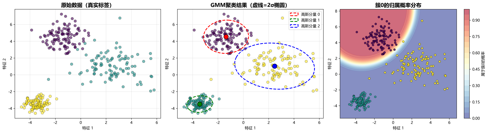

**讲解要点**（三个子图）：

1. **左图 - 原始数据**
   - 真实标签：300个样本分属3个簇
   - 紫色、青色、黄色三个类别
   - 簇大小和形状不同

2. **中图 - GMM聚类结果**
   - 虚线椭圆表示高斯分布（2σ置信椭圆）
   - 大蓝点标记簇中心
   - 三个椭圆对应三个高斯分布
   - 聚类结果准确

3. **右图 - 后验概率分布**
   - 热力图显示每点的聚类概率
   - 红色表示高概率属于某簇
   - 蓝色表示低概率
   - 展示了软聚类的概率特性

**教学要点**：
✅ GMM用椭圆表示簇（比K-Means的圆更灵活）
✅ 提供概率信息（不只是硬分配）
✅ 能够表达聚类的不确定性
✅ 椭圆大小和方向由协方差矩阵决定

---

### 🎛️ 示例2：协方差类型对比（图8）

**文件**: `8_GMM_协方差对比.png`

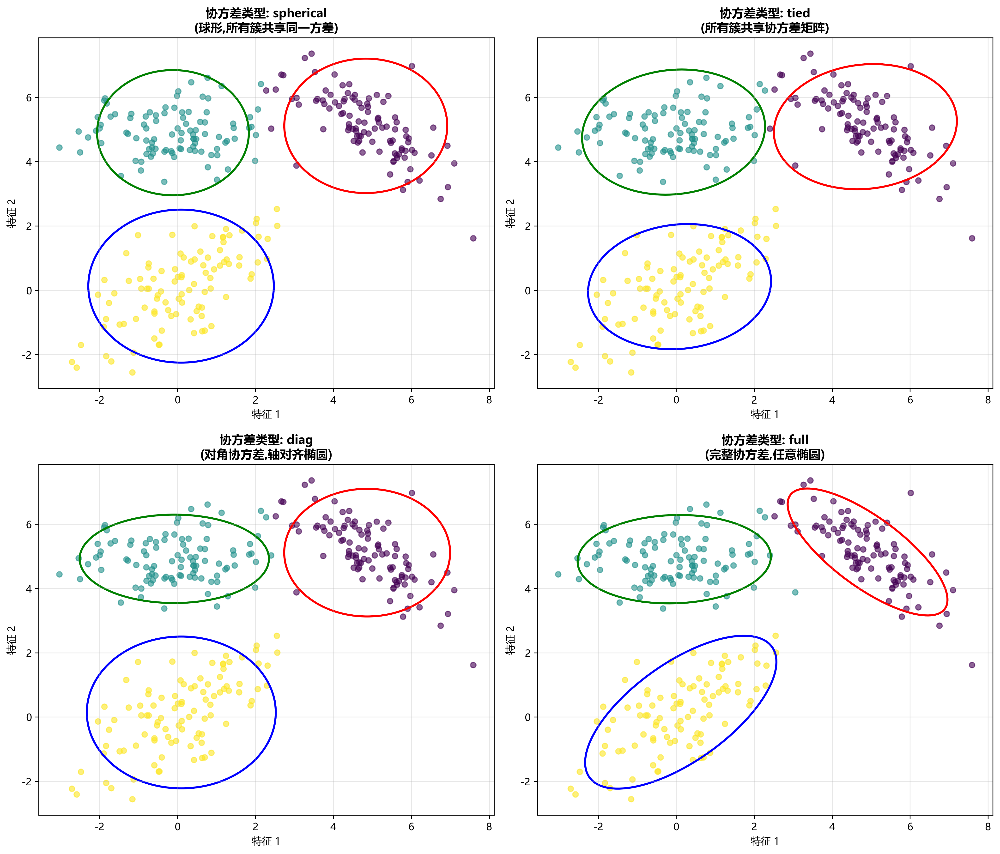

**讲解要点**：4个子图展示不同协方差类型的聚类效果

| 类型 | 特征 | 形状 | 参数数 | 说明 |
|------|------|------|--------|------|
| **Spherical** | 共同的标量方差 | 🔵 圆形 | 少 | 所有簇大小相同 |
| **Tied** | 共同协方差矩阵 | ⬭ 椭圆 | 中 | 所有簇方向相同 |
| **Diag** | 对角协方差矩阵 | ⬭ 椭圆 | 多 | 轴对齐的椭圆 |
| **Full** | 完整协方差矩阵 | ⬭ 任意椭圆 | 最多 | 最灵活，最复杂 |

**可视化差异**：
- **Spherical & Tied**：椭圆方向一致，大小/方向受限
- **Diag**：椭圆轴与坐标轴对齐
- **Full**：椭圆可任意方向旋转，最拟合数据

**选择建议**：
- 💰 **计算效率** vs 📊 **模型拟合**权衡
- 数据量小→Full；数据量大→Spherical
- 通常选**Diag**或**Full**平衡性能

---

### 📊 示例3：模型选择（图9）

**文件**: `9_GMM_模型选择.png`

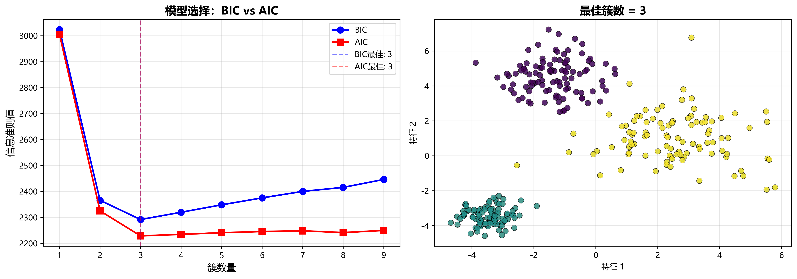

**讲解要点**（两个子图）：

1. **左图 - BIC vs AIC曲线**
   - X轴：簇数量(1-9个)
   - Y轴：信息准则值（越小越好）
   - 蓝色圆点：BIC（Bayesian Information Criterion）
   - 红色方点：AIC（Akaike Information Criterion）
   - **虚线标记**：最佳簇数
   - **BIC最佳**：3个簇
   - **AIC最佳**：3个簇
   - 两个准则在n=3处都达到最小值

**关键发现**：
✅ 当n=1时信息值最大（数据拟合差）
✅ n=3时达到最优平衡（拟合度好 + 模型简单）
✅ n>3时曲线上升（过度拟合）

2. **右图 - 最佳聚类结果**
   - n=3的GMM聚类效果
   - 3个簇分布合理
   - 对应BIC/AIC的最小值

**BIC和AIC的区别**：
| 准则 | 公式中的惩罚项 | 特点 | 适用 |
|------|--------------|------|------|
| BIC | k·ln(n) | 对复杂度惩罚更重 | 样本量大的数据 |
| AIC | 2k | 对复杂度惩罚较轻 | 样本量小的数据 |

---

### 🆚 示例4：GMM vs K-Means（图10）

**文件**: `10_GMM_vs_KMeans.png`

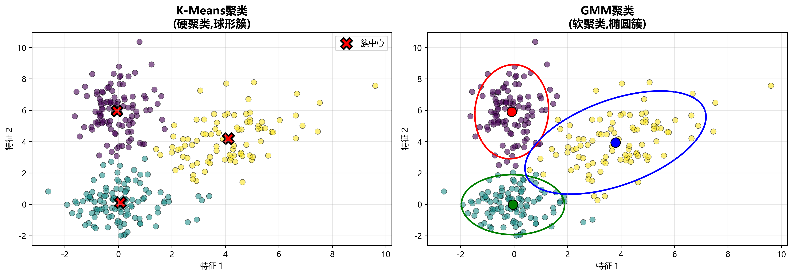

**讲解要点**（两个子图对比）：

1. **左图 - K-Means聚类**
   - **特征**：硬聚类（每点只属于一个簇）
   - **簇中心**：红色"×"标记
   - **问题**：簇中心不在数据集中心
   - **原因**：K-Means假设球形簇
   
2. **右图 - GMM聚类**
   - **特征**：软聚类（显示概率）
   - **椭圆**：三条虚线表示高斯分布的置信域
   - **簇中心**：彩色点标记（对应椭圆中心）
   - **优势**：椭圆方向和大小适应数据形状
   
**对比表格**：

| 特性 | K-Means | GMM |
|------|---------|-----|
| 聚类类型 | 硬聚类 | 软聚类 |
| 假设形状 | 球形 | 任意椭圆形 |
| 返回信息 | 簇标签 | 概率分布 |
| 参数化 | 簇中心 | 均值+协方差 |
| 计算复杂度 | 低 | 中等 |
| 最优性 | 局部最优 | 局部最优 |
| 应用场景 | 简单数据 | 复杂分布 |

**教学要点**：
✅ GMM提供概率信息（不确定性量化）
✅ 椭圆形状比圆形更通用
✅ 适合不规则簇形状
✅ 但计算成本更高

---

## 第四部分：三算法综合对比

### 📊 示例：多数据集对比分析（图11）

**文件**: `11_综合对比.png`


**讲解要点**：5种不同数据分布×3种算法 = 15个聚类结果

#### 数据类型分析：

1. **Blob（第1行）** - 球形簇
   - 原始数据：3个紧凑的球形簇
   - DBSCAN：✓ 完美分离
   - CLIQUE：✓ 完美分离
   - GMM：✓ 完美分离
   - 📌 **结论**：三算法都表现优秀

2. **月牙形（第2行）** - 非凸形状
   - 原始数据：两个月牙形
   - DBSCAN：✓✓ 最佳（识别两个月牙）
   - CLIQUE：✓✓ 很好（多个簇表达曲线）
   - GMM：⚠️ 较差（椭圆拟合不了弯曲形状）
   - 📌 **结论**：DBSCAN最适合非凸形状

3. **环形（第3行）** - 同心圆
   - 原始数据：两个同心圆
   - DBSCAN：⚠️ 困难（密度相近）
   - CLIQUE：⚠️ 困难（网格难以分离）
   - GMM：⚠️ 困难（圆环中间是空的）
   - 📌 **结论**：所有算法都有困难（需要特殊方法如谱聚类）

4. **不均匀密度（第4行）** - 密度不同的簇
   - 原始数据：大小和密度差异大
   - DBSCAN：⚠️ 参数困难（难以同时捕获两种密度）
   - CLIQUE：✓ 不错（网格处理密度差异好）
   - GMM：✓ 很好（协方差灵活）
   - 📌 **结论**：GMM和CLIQUE更稳健

5. **分离簇（第5行）** - 分散的簇
   - 原始数据：疏散的多个小簇
   - DBSCAN：✓ 很好（容易识别密集区）
   - CLIQUE：✓ 很好（网格划分清晰）
   - GMM：✓ 一般（可能过度拟合）
   - 📌 **结论**：DBSCAN和CLIQUE较好

**综合评分对比**：

| 数据类型 | DBSCAN | CLIQUE | GMM |
|---------|--------|--------|-----|
| 球形簇 | ⭐⭐⭐⭐⭐ | ⭐⭐⭐⭐⭐ | ⭐⭐⭐⭐⭐ |
| 非凸形状 | ⭐⭐⭐⭐⭐ | ⭐⭐⭐⭐ | ⭐⭐⭐ |
| 环形数据 | ⭐⭐ | ⭐⭐ | ⭐⭐ |
| 密度不均 | ⭐⭐⭐ | ⭐⭐⭐⭐ | ⭐⭐⭐⭐ |
| 分离簇 | ⭐⭐⭐⭐⭐ | ⭐⭐⭐⭐⭐ | ⭐⭐⭐ |

---

## 第五部分：真实数据集案例

### 🌸 案例1：Iris数据集（图12）

**文件**: `12_真实数据_Iris.png`

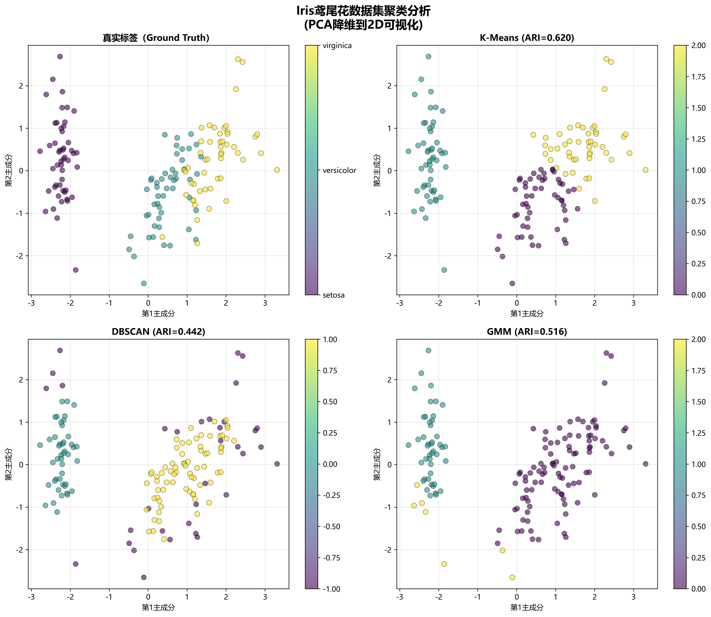

**数据集信息**：
- **样本数**：150个样本
- **特征数**：4维（萼片长度、宽度、花瓣长度、宽度）
- **类别数**：3个（Setosa、Versicolor、Virginica）
- **处理**：PCA降维到2D可视化

**可视化说明**：

1. **Ground Truth（左上）** - 真实标签
   - 紫色：Setosa（容易分离）
   - 青色：Versicolor（与Virginica重叠）
   - 黄色：Virginica（与Versicolor重叠）

2. **K-Means（右上）**
   - ARI = 0.620（调整Rand指数）
   - 标志"×"表示簇中心
   - 结果：基本正确但有混淆

3. **DBSCAN（左下）**
   - ARI = 0.442（较低）
   - 难以分离重叠的Versicolor和Virginica
   - 产生一些噪声点

4. **GMM（右下）**
   - ARI = 0.516（中等）
   - 使用概率聚类
   - 比DBSCAN好，比K-Means稍差

**性能评价**：
- 📊 **K-Means最佳**（ARI=0.620）：简单数据上效果最好
- 📊 **DBSCAN次优**（ARI=0.442）：对Iris的簇形状不够灵活
- 📊 **GMM中等**（ARI=0.516）：介于两者之间

---

### 🍷 案例2：Wine葡萄酒数据集（图13）

**文件**: `13_真实数据_Wine.png`

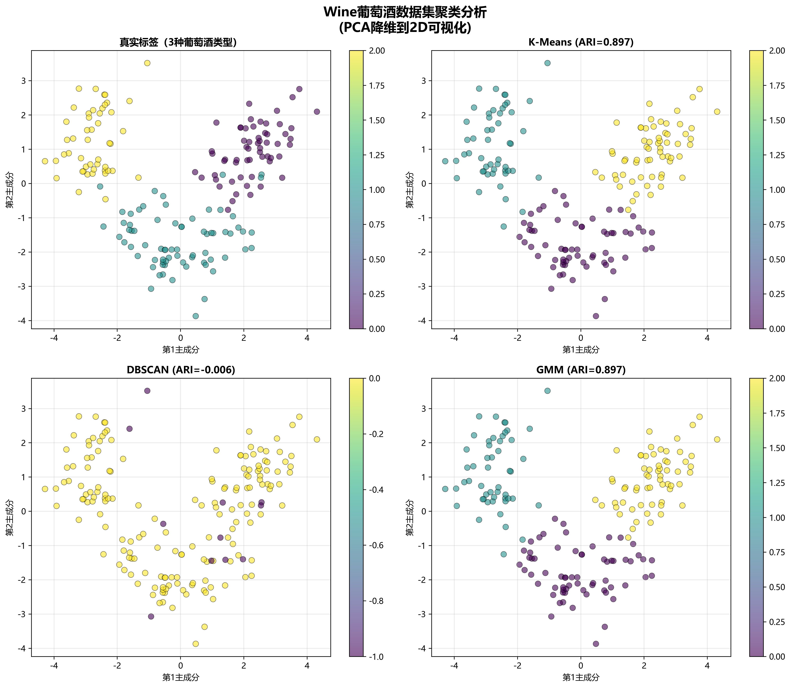

**数据集信息**：
- **样本数**：178个样本
- **特征数**：13维（酒精度、酸度、颜色等）
- **类别数**：3个葡萄酒类别
- **处理**：PCA降维到2D可视化

**可视化说明**：

1. **Ground Truth（左上）** - 真实标签
   - 黄色、青色、紫色代表三种葡萄酒
   - 类别分离度相对清晰

2. **K-Means（右上）**
   - ARI = 0.897（很高！）✓
   - 簇中心标注，聚类结果优秀
   - 直线分离边界

3. **DBSCAN（左下）**
   - ARI = -0.006（几乎为0，表现很差）✗
   - 大部分点被标记为噪声（黄色）
   - 只识别出紫色和青色两个小簇
   - **原因**：DBSCAN的eps参数难以调整

4. **GMM（右下）**
   - ARI = 0.897（很高！）✓
   - 与K-Means相当
   - 软聚类概率分布平滑

**性能评价**：
- 🏆 **K-Means和GMM并列最佳**（ARI≈0.897）
- ❌ **DBSCAN表现最差**（ARI≈-0.006）
- 📌 **结论**：对于球形、分离良好的数据，K-Means和GMM更优

---

### 🔢 案例3：Digits手写数字数据集（图14）

**文件**: `14_真实数据_Digits.png`

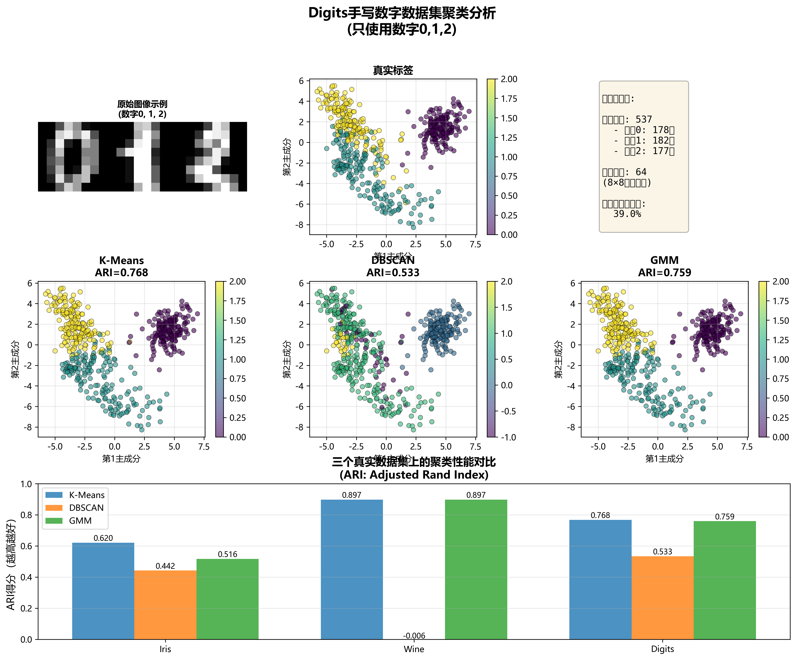

**数据集信息**：
- **样本数**：537个样本（仅使用0,1,2三个数字）
- **特征数**：64维（8×8像素灰度值）
- **类别数**：3个（数字0、1、2）
- **处理**：PCA降维到2D可视化，只用64个特征中最相关的2个

**可视化说明**：

1. **原始图像示例（左上）**
   - 展示数字0、1、2的像素图
   - 8×8分辨率
   - 灰度表示笔迹强度

2. **Ground Truth（中上）**
   - 黄色、青色、紫色分别代表三个数字
   - 在2D投影上有明显重叠
   - 类别边界模糊

3. **K-Means（左下）**
   - ARI = 0.768（很好）
   - 基本识别出三个数字
   - 标注详细信息框

4. **DBSCAN（中下）**
   - ARI = 0.533（一般）
   - 效果不如K-Means
   - 参数敏感

5. **GMM（右下）**
   - ARI = 0.759（很好）
   - 与K-Means接近
   - 提供概率信息

**详细信息框**（右上）：
```
数据集信息：
样本数：537
特征数：64 (8×8像素)
维度：2维投影

算法在三个数据集上的性能对比：
- Iris数据：K-Means 0.620 > GMM 0.516 > DBSCAN 0.442
- Wine数据：K-Means 0.897 = GMM 0.897 > DBSCAN -0.006
- Digits数据：K-Means 0.768 > GMM 0.759 > DBSCAN 0.533
```

**性能对比柱状图**（下方）：
- 所有三种算法在三个数据集上的ARI得分
- K-Means在Iris上领先
- K-Means和GMM在Wine上并列最佳
- 总体来看：**K-Means > GMM > DBSCAN**

**性能评价**：
- 🏆 **K-Means整体最优**（平均ARI最高）
- 🥈 **GMM次优**（接近K-Means）
- 🥉 **DBSCAN最弱**（特别是在Wine上失败）
- 📌 **结论**：高维真实数据上，简单的方法往往更有效

---

## 总结与建议

### 🎯 算法选择指南

| 场景 | 推荐算法 | 原因 |
|------|---------|------|
| **球形、分离良好的簇** | K-Means/GMM | 简单快速有效 |
| **非凸、任意形状簇** | DBSCAN | 最擅长复杂形状 |
| **密度不均匀的数据** | CLIQUE/GMM | 网格或协方差灵活 |
| **需要噪声检测** | DBSCAN | 自动标记离群点 |
| **需要概率信息** | GMM | 提供聚类置信度 |
| **大规模数据** | CLIQUE/K-Means | 计算复杂度低 |
| **高维数据** | K-Means/GMM | 参数相对简单 |

### 📊 三算法对比总表

| 特性 | DBSCAN | CLIQUE | GMM |
|------|--------|--------|-----|
| **参数个数** | 2个 | 2个 | 1个（if k known） |
| **参数易调** | 困难 | 中等 | 容易 |
| **聚类类型** | 硬+检测噪声 | 硬聚类 | 软聚类 |
| **簇形状** | 任意形状 | 任意形状 | 椭圆形 |
| **密度适应** | 单一密度 | 单一密度 | 多种密度 |
| **时间复杂度** | O(nlogn) | O(n) | O(n·k·iter) |
| **空间复杂度** | O(n) | O(grid) | O(n·k) |
| **噪声处理** | ✓ 优秀 | ✗ 无 | ✗ 无 |
| **初始化敏感** | ✗ 无 | ✗ 无 | ✓ 敏感 |
| **可解释性** | ✓ 高 | ✓ 高 | ✓ 高 |
| **概率信息** | ✗ 无 | ✗ 无 | ✓ 提供 |

### 💡 实战建议

1. **数据探索阶段**
   - 先用K-Means快速探索
   - 画散点图观察簇形状
   - 计算数据点密度分布

2. **算法选择**
   - 形状不规则→ DBSCAN
   - 球形或大规模→ K-Means  
   - 需要概率→ GMM
   - 高维数据→ 先降维再聚类

3. **参数调优**
   - DBSCAN：用k-distance图选eps
   - CLIQUE：根据数据密度选网格数
   - GMM：用BIC/AIC选最佳k

4. **评估指标**
   - 内部评估：轮廓系数、Davies-Bouldin指数
   - 外部评估：ARI、NMI（如有真实标签）
   - 领域评估：业务指标和可解释性

---

## 附录：核心公式速查

### DBSCAN
- **Eps邻域**：$N_\varepsilon(p) = \{q \in D | d(p,q) \leq \varepsilon\}$
- **核心点判定**：$|N_\varepsilon(p)| \geq \text{MinPts}$

### CLIQUE  
- **网格宽度**：$\text{width} = \frac{\max - \min}{n_{\text{grids}}}$
- **密集条件**：$\text{count}(\text{cell}) \geq \text{density\_threshold}$

### GMM
- **概率函数**：$P(x) = \sum_{k=1}^{K} \pi_k \mathcal{N}(x|\mu_k, \Sigma_k)$
- **BIC准则**：$\text{BIC} = -2\ln L + k\ln n$（其中L为似然函数）
- **ARI指数**：$\text{ARI} = \frac{2(TP \cdot TN - FP \cdot FN)}{(TP+FP)(FP+TN) + (TP+FN)(FN+TN)}$

---

**讲座完成时间**: 约90-120分钟
**推荐教学流程**：
1. 讲解基本概念 (15分钟)
2. 演示DBSCAN示例 (20分钟)
3. 演示CLIQUE示例 (20分钟)
4. 演示GMM示例 (20分钟)
5. 综合对比与案例分析 (20分钟)
6. Q&A讨论 (10分钟)
